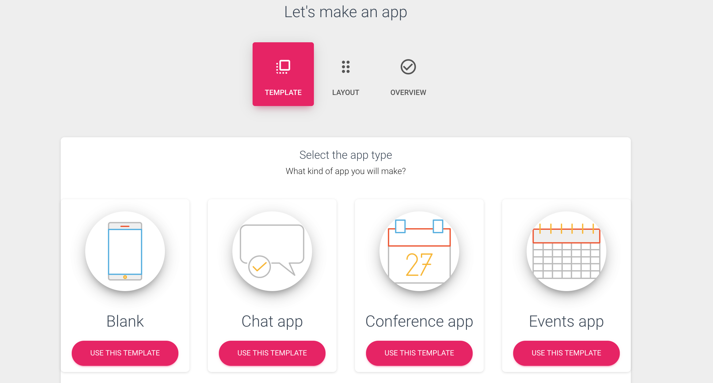
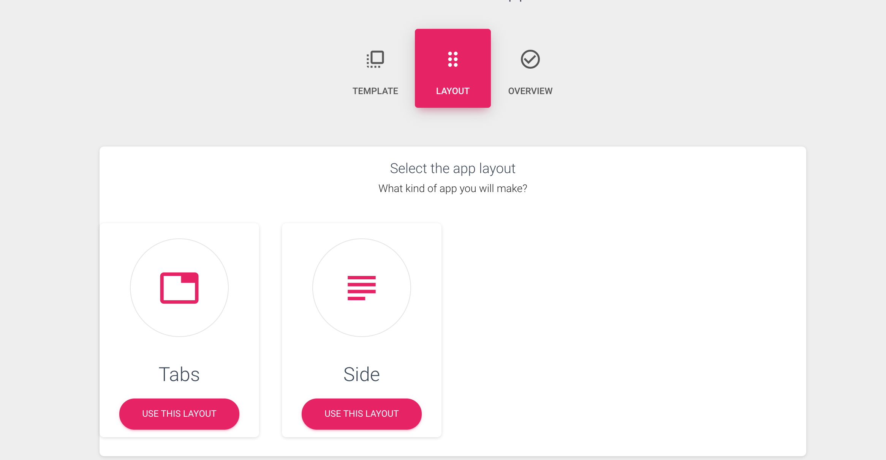
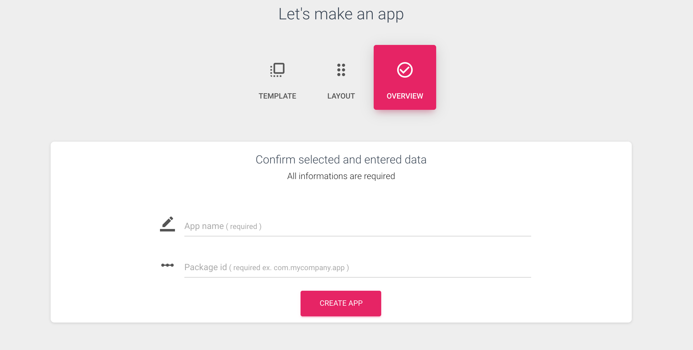

# Create apps in the app builder

Soon as you log in, and have subscribed to a plan, you will be able to make a new app.

After that choose a template, for now, you can choose between 12 templates, but stay tuned, new templates are coming soon. Templates have already created an app with the basic sections \(ex: Conference template contains: agenda, the location where the conference is, buy a tickets section, social and etc\). You can add or delete a section, it's up to your needs.

Next, you have to choose a layout. For now, there are two layouts \(**tabs** and **side**\). But very soon **grid** layout will be included. 

In the end, you should enter the app name and app id in the fields like in the picture below.

