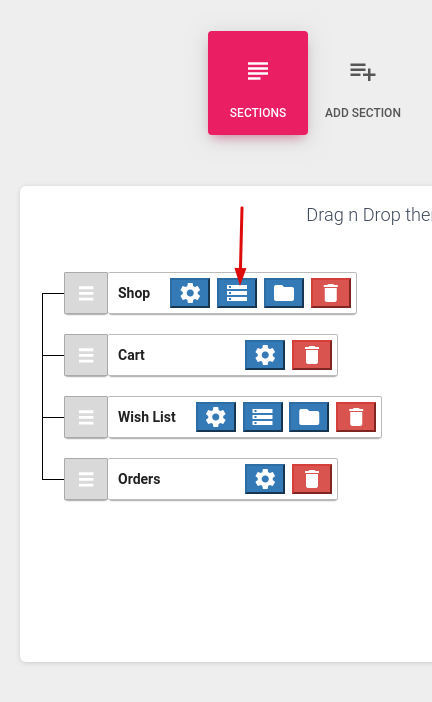
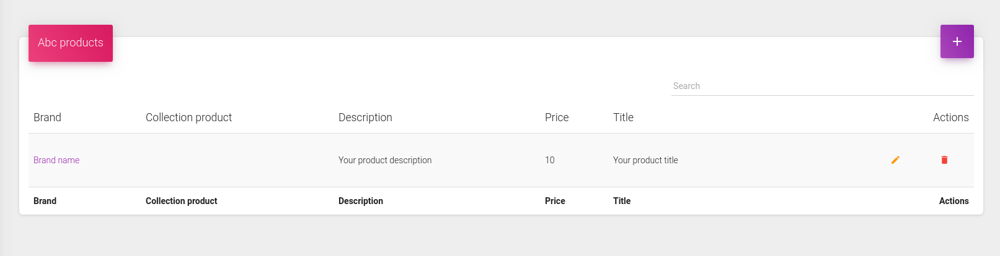
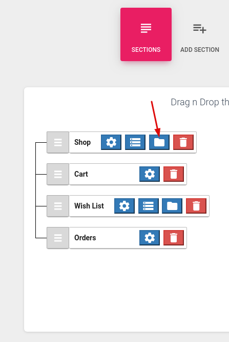

# Section content

Master-detail views - events, shop, food menu, recipe, gallery, radio and general all have the option to display different content. You can access and manage this content from the "**Database**" icon on each section.

By clicking on the icon, a new window will appear, where you can add your content.

Clicking on the "**Folder**" icon will open the categories screen for that section. 

By clicking on the icon, a new window will appear, where you can add your categories.

