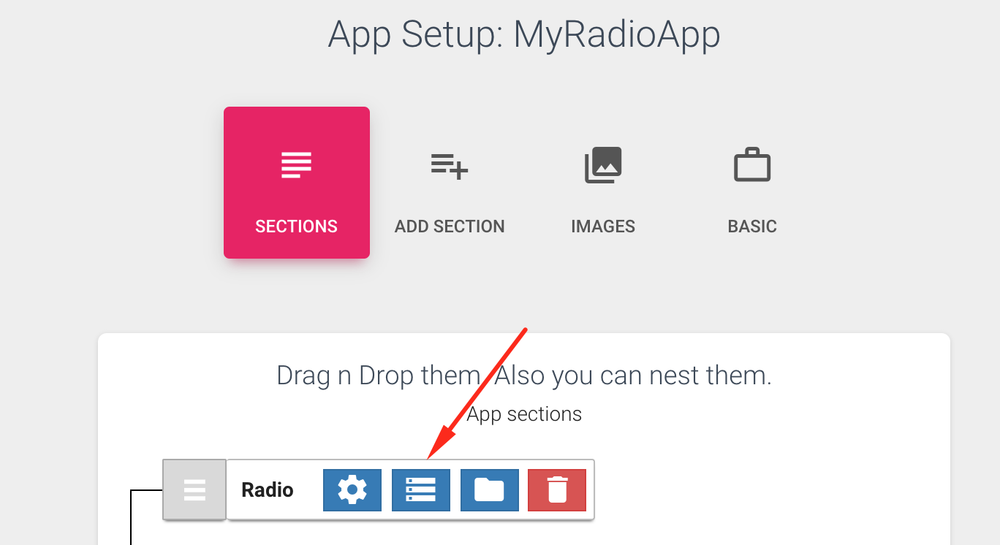
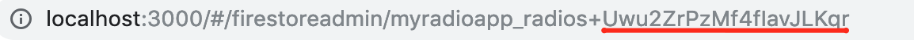
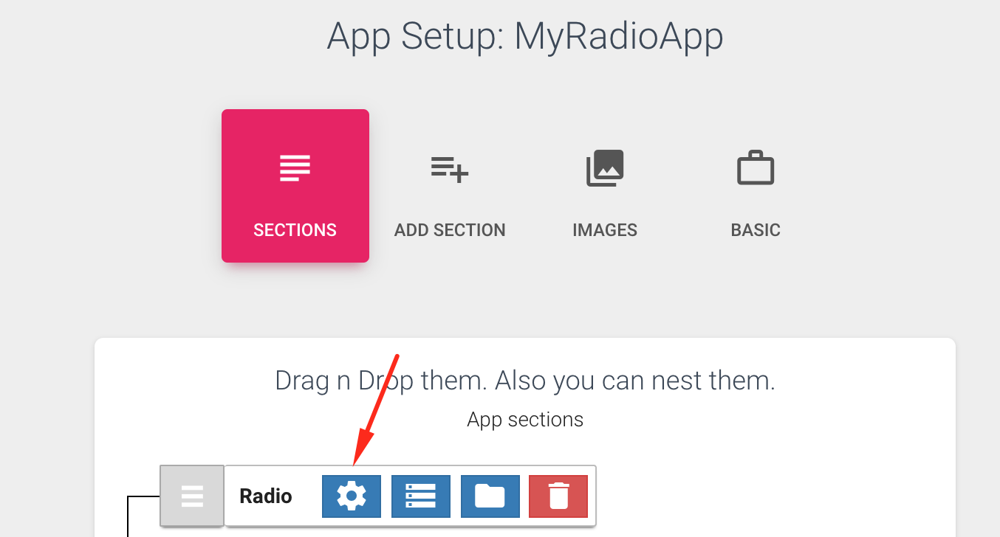
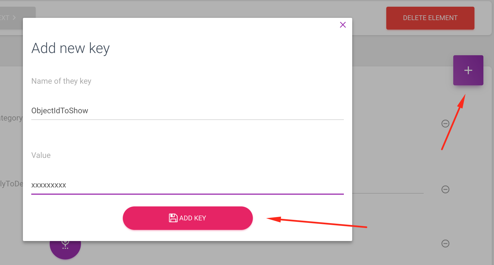

# Radio App Setup

In this section, we explain the common things you can do to a certain component/template.

#### [Startup Item  / Use case - Radio App](https://mobidonia.support-hub.io/articles/radio-app-setup#startup-item-use-case-radio-app) 

In the radio app, there are two mods. 

1. Multi-radio station
2. Single radio station 

In the case of the 2, where you have a single radio station it is common that you want the app to start playing soon as user open the app. So the idea will be to directly go in that radio details page. 

And yes, this is possible but requires small manual work. 

You should already have added a radio station, you have learned that in "Section content". 

Go in that that radio station, that you want to open/start when app starts.

At the top, in the address bar, you will notice a radio station ID number

Copy that number. 

Now go to Setting of the radio station. 

There you will see "**ObjectIdToShow**"

Enter the copied number there.  Now your station will start directly. 

Note that this can be applied to every section. you can manually add the o**bjectIdToShow** key.

