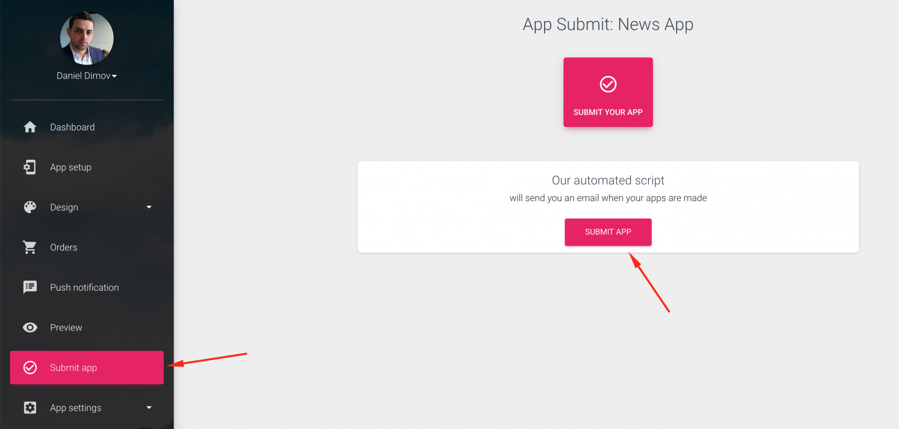

# Submit app for creation

To submit your app to be compiled, click on the "Submit App"



Click on the **Submit App** button

Our automated process will compile, and build your mobile app in a few minutes - usually 10-20. 

Next, you should see this screen.


Click on the **Download App.json** button

This file contains your app meta-data. 

Place it in a folder. 

When you receive an email, that your app is successfully produced, follow the instructions provided. 

### [Instructions](https://mobidonia.support-hub.io/articles/submit-app-for-creation#instructions)

#### **Step 1. Install the Expo CLI**

First, you will need Node. 

Install it from here

[https://nodejs.org/en/](https://nodejs.org/en/)

Run this command in your Command Prompt or terminal.

Mac:

```text
sudo npm install expo-cli --global
```

Windows \(Open Command Prompt as administrator\):

```text
npm install expo-cli --global  
```

### **Step 2. Login in the expo cli**

Run the command: expo login

Username: **mobidonia**

Password: **AppPreview**

### [Step 3. Download the app.json file from the link above.](https://mobidonia.support-hub.io/articles/submit-app-for-creation#step-3-download-the-appjson-file-from-the-link-above)

Create a folder and place the app.json file there.

### [Step 4. Download package.json file](https://mobidonia.support-hub.io/articles/submit-app-for-creation#step-4-download-packagejson-file)

Download [this package.json ](https://bit.ly/2UjNmQF)file and put in the same place where you added app.json

Run this command in your Command Prompt or terminal.

Navigate to the folder where app.json and package.json file is and run 

```text
npm install
```

### **Step 5. Publish app**

Follow the docs provided in the Publishing and updating section. 

