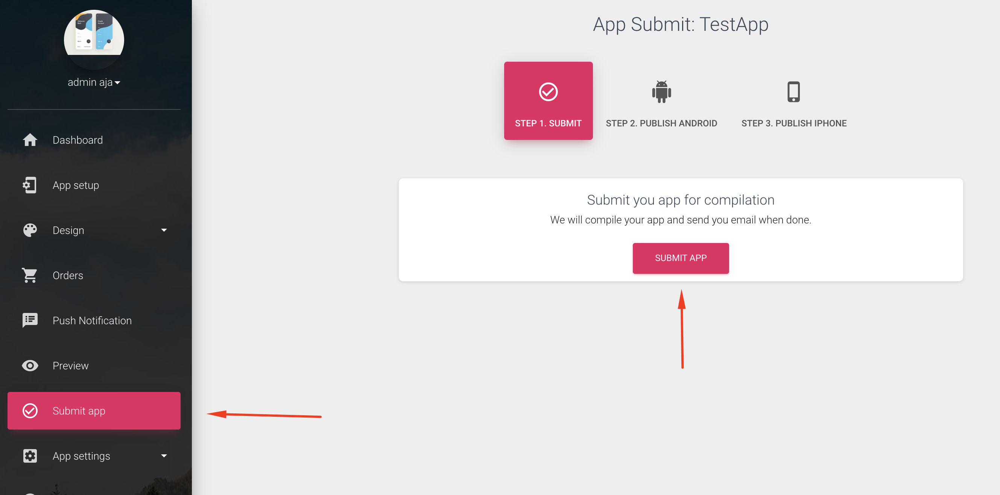
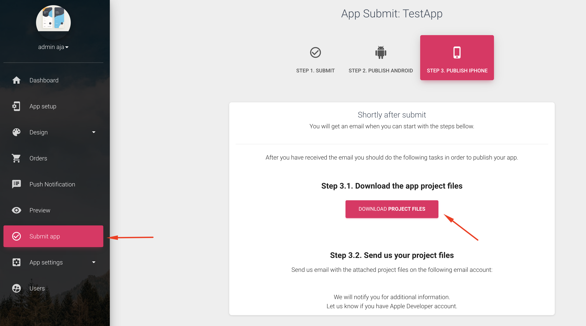

# Submit app for creation

To submit your app to be compiled, click on the "Submit App"

Click on the **Submit App** button

Our automated process will compile, and build your mobile app in a few minutes - usually 10-20.

We will send you a link that contains a .aab file. This is new version of apk file. It will be around 50MB. But when uploaded on your Google Play Developer console, Google will shrink to 16-20MB. 

For iPhone app. We will need some extra things from your side. Head over to iPhone

Send us email with info on how we can proceed. 

What we will do, is we will compile and make your app. But we will need you to provide us with your Apple Developer Account credentials \( 99$/y \) so we can upload your iPhone app. There is option also to upload the app on ours Apple Dev Account. So Pls emails us with your requirements.

