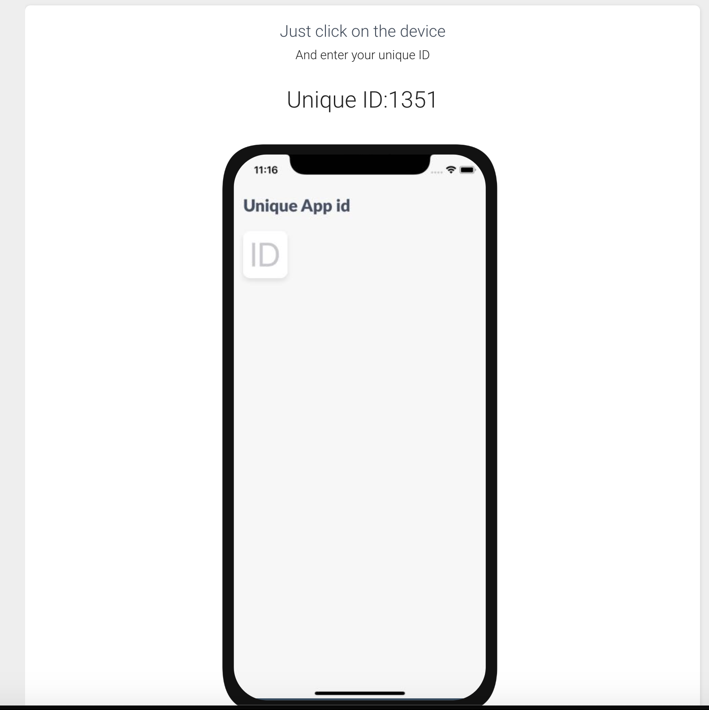

# Preview your app

## Preview the app in Browser

If you go to preview, you will see a iPhone in the browser, and Unique ID number.  
Enter this Unique ID in the app, and you will be able to preview your app directly in browser.

